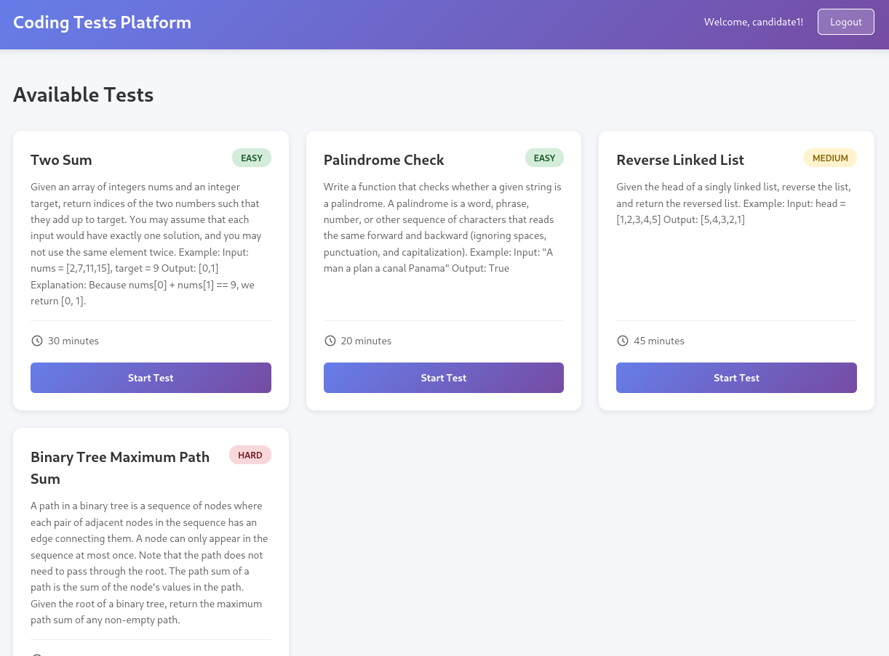
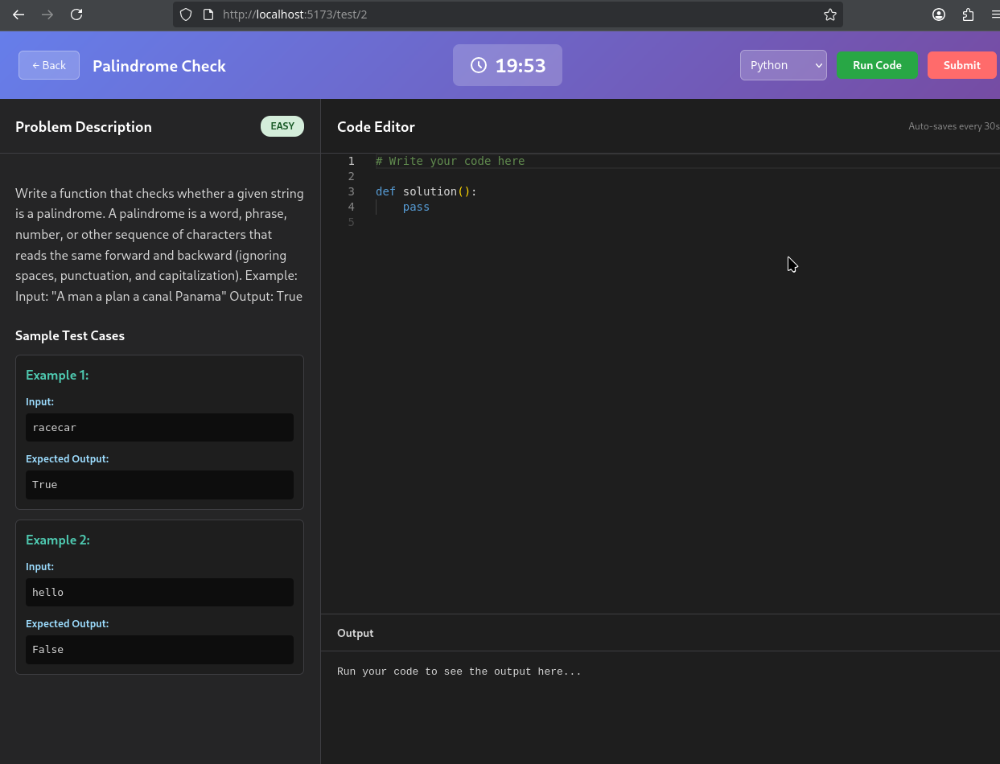

# Django React Coding Tests Platform

vA full-stack web application for conducting coding tests/interviews with real-time code execution, automatic grading, and progress tracking.

## Images







## Features

### Frontend (React + Vite)
- ✅ **User Authentication** - JWT-based login/register
- 📊 **Candidate Dashboard** - View and start coding tests
- 💻 **Coding Environment** with:
  - Monaco Editor (VS Code editor)
  - Multi-language support (Python, JavaScript, Java, C++)
  - Syntax highlighting for all supported languages
  - Auto-save every 30 seconds
  - Real-time countdown timer
  - Output display panel
  - Run & Submit functionality

### Backend (Django REST Framework)
- 🔐 **JWT Authentication** with token refresh
- 📝 **Test Management** - CRUD operations for tests
- ✅ **Test Cases** - Sample and hidden test cases
- 🏃 **Code Execution** - Sandboxed code execution with timeout
- 💾 **Auto-save Support** - Save candidate progress
- 📊 **Submissions & Scoring** - Automatic grading
- 👨‍💼 **Admin Panel** - Manage tests, view submissions

## Tech Stack

### Frontend
- React 19
- Vite
- React Router DOM
- Monaco Editor (syntax highlighting for 100+ languages)
- Axios

### Backend
- Django 6.0
- Django REST Framework
- djangorestframework-simplejwt
- django-cors-headers
- PostgreSQL (production) / SQLite (development)

Quick Start

### Option 1: Docker (Recommended for Production) 🐳

**Single command deployment with PostgreSQL:**

```bash
# Copy environment template and configure
cp .env.docker.example .env.docker

# Build and run
docker-compose up --build
```

Access the application at http://localhost:8000

📖 **Full Docker documentation**: See [DOCKER.md](DOCKER.md) for detailed deployment guide

### Option 2: Local Development Setup

For active development with hot-reload:

### Prerequisites
- Python 3.13+
- Node.js 18+
- npm/yarn

### Backend Setup

1. **Create and activate virtual environment:**
   ```bash
   python -m venv codingtestsvenv
   source codingtestsvenv/bin/activate  # On Windows: codingtestsvenv\Scripts\activate
   ```

2. **Install Python dependencies:**
   ```bash
   cd backend
   pip install django djangorestframework djangorestframework-simplejwt django-cors-headers
   ```

3. **Apply migrations:**
   ```bash
   python manage.py makemigrations
   python manage.py migrate
   ```

4. **Create superuser (for admin panel):**
   ```bash
   python manage.py createsuperuser
   ```

5. **Start Django server:**
   ```bash
   python manage.py runserver
   ```
   Backend will run at http://localhost:8000

### Frontend Setup

1. **Navigate to frontend directory:**
   ```bash
   cd frontend
   ```

2. **Install dependencies:**
   ```bash
   npm install
   ```

3. **Start development server:**
   ```bash
   npm run dev
   ```
   Frontend will run at http://localhost:5173

## Project Structure

```
django-react-coding-tests-platform/
├── backend/
│   ├── coding_platform/        # Django project settings
│   │   ├── settings.py
│   │   ├── urls.py
│   │   └── wsgi.py
│   ├── users/                  # User authentication app
│   │   ├── models.py           # CustomUser model
│   │   ├── views.py            # Auth views
│   │   ├── serializers.py
│   │   └── urls.py
│   ├── codetests/              # Coding tests app
│   │   ├── models.py           # Test, TestCase, Submission, CodeProgress
│   │   ├── views.py            # Test CRUD, code execution
│   │   ├── serializers.py
│   │   ├── urls.py
│   │   └── admin.py
│   └── manage.py
├── frontend/
│   ├── src/
│   │   ├── api/                # API service layer
│   │   ├── components/         # React components
│   │   ├── context/            # Auth context
│   │   ├── pages/              # Page components
│   │   ├── App.jsx
│   │   └── main.jsx
│   ├── package.json
│   └── vite.config.js
└── codingtestsvenv/            # Python virtual environment
```

## API Documentation

### Authentication
```
POST /api/users/register/     - Register new user
POST /api/users/login/        - Login (returns JWT tokens)
GET  /api/users/me/           - Get current user
```

### Tests
```
GET    /api/tests/             - List all tests
GET    /api/tests/:id/         - Get test details
GET    /api/tests/:id/testcases/  - Get test cases
POST   /api/tests/:id/submit/     - Submit solution
POST   /api/tests/execute/        - Execute code
POST   /api/tests/:id/save/       - Save progress
GET    /api/tests/:id/saved/      - Get saved code
```

## Database Models

### Users App
- **CustomUser** - Extended Django user model

### Codetests App
- **Test** - name, description, time_limit, difficulty, created_at
- **TestCase** - test, input_data, expected_output, is_sample
- **Submission** - user, test, code, language, status, score, submitted_at
- **CodeProgress** - user, test, code, language, updated_at

## Usage

1. **Register** a new account or login
2. **Browse** available tests on the dashboard
3. **Start** a test to enter the coding environment
4. **Write** code in the Monaco editor
5. **Run** code to test against sample cases
6. **Submit** when ready for final evaluation
7. Code is **auto-saved** every 30 seconds

## Admin Features

Access admin panel at http://localhost:8000/admin/

- Create and manage tests
- Add test cases (sample and hidden)
- View all submissions
- Track candidate progress
- Monitor scores

## Security Features

- JWT authentication with token refresh
- Protected API endpoints
- CORS configuration
- Code execution timeout (5 seconds)
- Subprocess isolation for code execution

## Production Considerations

For production deployment:

1. Use environment variables for secrets
2. Implement Docker containers for code execution
3. Add rate limiting
4. Use PostgreSQL instead of SQLite
5. Configure proper CORS origins
6. Enable HTTPS
7. Add logging and monitoring

## Contributing

1. Fork the repository
2. Create a feature branch
3. Commit your changes
4. Push to the branch
5. Create a Pull Request


## License

This project is licensed under the GNU GENERAL PUBLIC LICENSE.


## Acknowledgments

- Monaco Editor by Microsoft
- Django REST Framework
- React team
- Vite team
